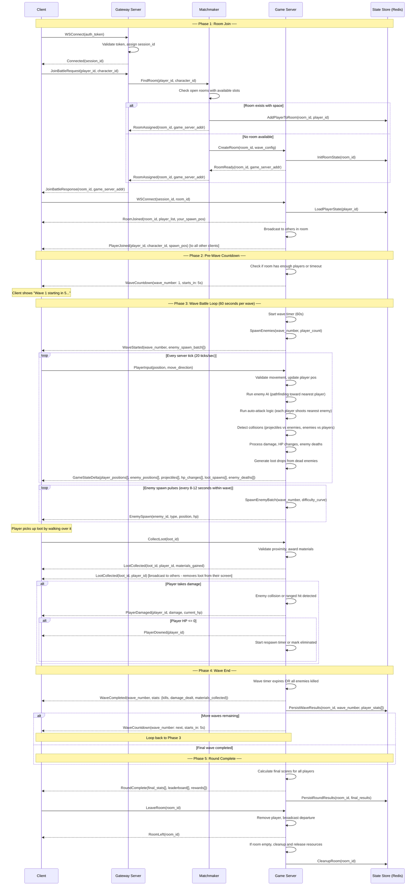
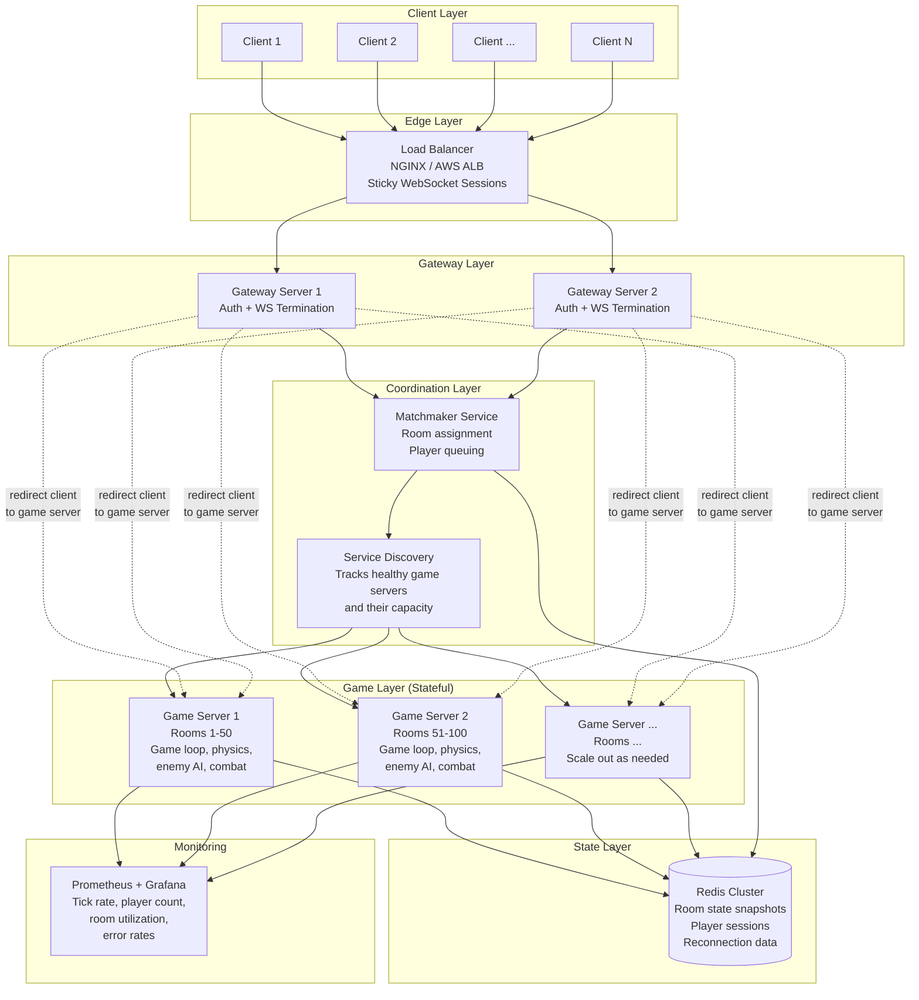

# AlantrixGeim - Game Backend Programming Assessment

## Brotato-Style Multiplayer Battle Server Design

---

## Table of Contents

1. [Server-Client Communication (Mermaid Chart)](#1-server-client-communication)
2. [Messages Contract](#2-messages-contract)
3. [Server Architecture (Mermaid Chart + Description)](#3-server-architecture)
4. [Player Limit Justification](#4-player-limit-justification)
5. [Client Reconnecting](#5-client-reconnecting)
6. [Load Balancing](#6-load-balancing)
7. [Server Recovery](#7-server-recovery)
8. [Horizontal Scaling](#8-horizontal-scaling)

---

## 1. Server-Client Communication

This diagram covers the full lifecycle from the moment a player requests to join a battle room until they finish their round. The shopping mechanic is excluded entirely - we only care about the battle phase.



---

## 2. Messages Contract

All messages use JSON over WebSocket. Each message has a `type` field and a `payload` field. The server uses binary-packed formats internally for the high-frequency game state deltas, but the logical contract is described here.

### 2.1 Connection & Room Join

#### Client -> Gateway

```json
// Initial WebSocket connection is established with auth_token in header/query

// Request to join a battle
{
  "type": "JOIN_BATTLE_REQUEST",
  "payload": {
    "player_id": "string (uuid)",
    "character_id": "string",
    "preferred_region": "string (optional, e.g. 'ap-southeast-1')"
  }
}
```

#### Gateway -> Client

```json
// After successful connection
{
  "type": "CONNECTED",
  "payload": {
    "session_id": "string (uuid)",
    "server_time": "number (unix ms)"
  }
}

// Room assignment
{
  "type": "JOIN_BATTLE_RESPONSE",
  "payload": {
    "room_id": "string (uuid)",
    "game_server_addr": "string (wss://...)",
    "token": "string (short-lived join token)"
  }
}
```

#### Client -> Game Server

```json
// Connect to the assigned game server
{
  "type": "ROOM_CONNECT",
  "payload": {
    "session_id": "string",
    "room_id": "string",
    "token": "string"
  }
}

// Leave room voluntarily
{
  "type": "LEAVE_ROOM",
  "payload": {
    "room_id": "string"
  }
}
```

#### Game Server -> Client

```json
// Successful room entry
{
  "type": "ROOM_JOINED",
  "payload": {
    "room_id": "string",
    "players": [
      {
        "player_id": "string",
        "character_id": "string",
        "display_name": "string",
        "position": { "x": "number", "y": "number" },
        "hp": "number",
        "max_hp": "number"
      }
    ],
    "your_spawn_position": { "x": "number", "y": "number" },
    "room_config": {
      "max_players": 8,
      "total_waves": 20,
      "wave_duration_sec": 60,
      "arena_width": 1920,
      "arena_height": 1080
    }
  }
}

// Broadcast when someone else joins the room
{
  "type": "PLAYER_JOINED",
  "payload": {
    "player_id": "string",
    "character_id": "string",
    "display_name": "string",
    "position": { "x": "number", "y": "number" }
  }
}

// Broadcast when someone leaves
{
  "type": "PLAYER_LEFT",
  "payload": {
    "player_id": "string",
    "reason": "string (voluntary | disconnected | kicked)"
  }
}

// Confirmed departure
{
  "type": "ROOM_LEFT",
  "payload": {
    "room_id": "string"
  }
}
```

### 2.2 Wave Lifecycle

#### Game Server -> Client

```json
// Countdown before wave starts
{
  "type": "WAVE_COUNTDOWN",
  "payload": {
    "wave_number": "number",
    "starts_in_ms": "number",
    "enemy_types_preview": ["string"]
  }
}

// Wave begins
{
  "type": "WAVE_STARTED",
  "payload": {
    "wave_number": "number",
    "duration_sec": 60,
    "initial_enemies": [
      {
        "enemy_id": "string",
        "type": "string (basic | ranged | egg_layer | charger)",
        "position": { "x": "number", "y": "number" },
        "hp": "number",
        "max_hp": "number"
      }
    ]
  }
}

// Mid-wave enemy spawn pulse
{
  "type": "ENEMY_SPAWN",
  "payload": {
    "enemies": [
      {
        "enemy_id": "string",
        "type": "string",
        "position": { "x": "number", "y": "number" },
        "hp": "number",
        "max_hp": "number"
      }
    ]
  }
}

// Wave ends
{
  "type": "WAVE_COMPLETED",
  "payload": {
    "wave_number": "number",
    "player_stats": [
      {
        "player_id": "string",
        "kills": "number",
        "damage_dealt": "number",
        "damage_taken": "number",
        "materials_collected": "number"
      }
    ]
  }
}
```

### 2.3 In-Battle (High Frequency)

#### Client -> Game Server

```json
// Sent every frame or at fixed interval (e.g., 20Hz)
{
  "type": "PLAYER_INPUT",
  "payload": {
    "sequence_num": "number (for reconciliation)",
    "move_direction": { "x": "number (-1 to 1)", "y": "number (-1 to 1)" },
    "timestamp": "number (client time in ms)"
  }
}

// Player walks over loot
{
  "type": "COLLECT_LOOT",
  "payload": {
    "loot_id": "string"
  }
}
```

#### Game Server -> Client (State Sync - sent at 20Hz tick rate)

```json
// Delta-compressed game state update
{
  "type": "GAME_STATE_DELTA",
  "payload": {
    "tick": "number",
    "server_time": "number",
    "players": [
      {
        "player_id": "string",
        "position": { "x": "number", "y": "number" },
        "hp": "number",
        "is_alive": "boolean"
      }
    ],
    "enemies": [
      {
        "enemy_id": "string",
        "position": { "x": "number", "y": "number" },
        "hp": "number",
        "target_player_id": "string"
      }
    ],
    "projectiles": [
      {
        "proj_id": "string",
        "owner_id": "string (player_id)",
        "position": { "x": "number", "y": "number" },
        "direction": { "x": "number", "y": "number" },
        "type": "string"
      }
    ],
    "events": [
      {
        "event_type": "string (enemy_killed | player_damaged | loot_spawned | loot_collected | projectile_hit | egg_hatched)",
        "data": "object (varies by event_type)"
      }
    ]
  }
}
```

### 2.4 Event-Specific Payloads (inside `events[]`)

```json
// Enemy killed
{
  "event_type": "enemy_killed",
  "data": {
    "enemy_id": "string",
    "killed_by": "string (player_id)",
    "position": { "x": "number", "y": "number" },
    "loot_drops": [
      {
        "loot_id": "string",
        "type": "string (material | hp_orb)",
        "value": "number",
        "position": { "x": "number", "y": "number" }
      }
    ]
  }
}

// Player damaged
{
  "event_type": "player_damaged",
  "data": {
    "player_id": "string",
    "damage": "number",
    "current_hp": "number",
    "source": "string (enemy_id or 'environment')"
  }
}

// Player downed
{
  "event_type": "player_downed",
  "data": {
    "player_id": "string",
    "killed_by": "string",
    "respawn_in_ms": "number (0 if eliminated)"
  }
}

// Loot collected
{
  "event_type": "loot_collected",
  "data": {
    "loot_id": "string",
    "collected_by": "string (player_id)",
    "materials_gained": "number"
  }
}

// Egg hatched (egg-layer enemy mechanic)
{
  "event_type": "egg_hatched",
  "data": {
    "egg_id": "string",
    "hatched_enemy": {
      "enemy_id": "string",
      "type": "string (mini_boss)",
      "position": { "x": "number", "y": "number" },
      "hp": "number"
    }
  }
}
```

### 2.5 Round Completion

#### Game Server -> Client

```json
// All waves finished
{
  "type": "ROUND_COMPLETE",
  "payload": {
    "room_id": "string",
    "total_waves_survived": "number",
    "leaderboard": [
      {
        "rank": "number",
        "player_id": "string",
        "display_name": "string",
        "total_kills": "number",
        "total_damage_dealt": "number",
        "total_materials": "number",
        "waves_survived": "number",
        "score": "number"
      }
    ]
  }
}
```

### 2.6 Reconnection Messages

#### Client -> Game Server

```json
{
  "type": "RECONNECT",
  "payload": {
    "session_id": "string",
    "room_id": "string",
    "last_known_tick": "number"
  }
}
```

#### Game Server -> Client

```json
// Full state snapshot for reconnecting player
{
  "type": "RECONNECT_STATE",
  "payload": {
    "room_id": "string",
    "current_wave": "number",
    "wave_time_remaining_ms": "number",
    "your_state": {
      "position": { "x": "number", "y": "number" },
      "hp": "number",
      "max_hp": "number",
      "materials": "number",
      "is_alive": "boolean"
    },
    "full_game_state": "GameStateDelta (complete snapshot, not delta)"
  }
}

// Reconnection denied
{
  "type": "RECONNECT_DENIED",
  "payload": {
    "reason": "string (room_closed | round_ended | session_expired | player_replaced)"
  }
}
```

### 2.7 Heartbeat / Keep-Alive

```json
// Bidirectional - both client and server send these
{
  "type": "PING",
  "payload": {
    "timestamp": "number"
  }
}

{
  "type": "PONG",
  "payload": {
    "timestamp": "number",
    "server_time": "number"
  }
}
```

---

## 3. Server Architecture



### Architecture Description

I went with a layered approach here because each piece of this system has a very different job, and trying to cram them all into one monolith would be a nightmare to scale or debug.

**Gateway Layer** - These servers handle the initial WebSocket connection from clients. They deal with authentication, session management, and then redirect the client to whichever game server is actually running their room. The reason I split this out from the game servers is simple: you do not want your game servers wasting CPU cycles on auth checks and connection handshakes when they should be running physics at a steady 20 ticks per second. Gateways are stateless and cheap to spin up.

**Matchmaker** - This is a standalone service that keeps track of which rooms exist, how many slots they have open, and which game server is hosting them. When a player wants to join, the matchmaker either slots them into an existing room or asks a game server to spin up a new one. I kept this separate because matchmaking logic tends to get more complex over time (you might want skill-based matching, region preferences, party support), and having it isolated means you can iterate on it without touching the game servers.

**Game Servers** - These are the workhorses. Each one runs multiple rooms, and each room runs its own game loop at 20 ticks per second. They handle all the core battle logic: enemy AI pathfinding, auto-attack targeting, collision detection, damage calculations, loot drops, wave progression. I chose 20Hz because Brotato is not a twitch shooter - the gameplay is about positioning and dodging swarms, not pixel-perfect aim. 20 updates per second gives smooth enough movement while keeping bandwidth and CPU reasonable when you have got 8 players and potentially 150+ enemies on screen.

**Redis** - Acts as the shared state backbone. Game servers periodically snapshot room state to Redis so that if a server goes down, another one can pick up where it left off. It also stores player session data for reconnection. I went with Redis specifically because the data is ephemeral (a room lasts maybe 20-30 minutes tops) and Redis gives you sub-millisecond reads, which matters when a player reconnects and you need to get them back into the action fast.

**Service Discovery** - Keeps a live registry of which game servers are healthy and how loaded they are. The matchmaker checks this before assigning rooms. This is what makes horizontal scaling work - when you add a new game server, it registers itself here, and the matchmaker starts sending rooms to it automatically.

---

## 4. Player Limit Justification

**Recommended maximum: 8 players per room.**

I landed on 8 after thinking through what actually happens on the server during a Brotato-style battle. Here is the reasoning:

The main performance bottleneck in this kind of game is not player count by itself - it is the total number of entities the server has to simulate every tick. In Brotato, enemies scale with difficulty, and in a multiplayer version, you would want to scale enemy count with player count too, so the arena does not feel empty. A rough estimate: with 8 players, you are looking at around 120-180 enemies on screen during later waves, plus projectiles from auto-attacks (one per player per weapon, so potentially 8-48 projectiles depending on weapon count), plus loot drops on the ground.

At 20 ticks per second, that means the server is processing roughly this per tick:
- 8 player position validations
- 150 enemy AI decisions (pick target, pathfind, move)
- 150 collision checks (enemy vs player, enemy vs projectile)
- 30-ish projectile trajectory updates
- Damage calculations, death events, loot spawns

That is well within what a single thread on a modern server can handle in under 50ms, which is your tick budget at 20Hz.

Now, why not go higher? At 16 players, you would double the enemy count to keep the challenge balanced, pushing you to 300+ enemies. Pathfinding alone starts eating into your tick budget, and the network bandwidth for broadcasting 300+ entity positions to 16 clients 20 times per second gets ugly fast. You are looking at roughly 200-300KB/s per client just for state deltas, which might be fine on a desktop but starts causing problems on weaker connections.

Why not go lower? At 4 players, the arena feels sparse and you lose the "massive multiplayer" feel that the assessment asks for. 4 is basically a co-op session, not a room that feels alive.

8 gives you that sweet spot where the arena is chaotic enough to feel exciting, there are enough players that cooperation and competition both emerge naturally, but the server can still maintain a rock-solid tick rate without cutting corners on the simulation. It is also a number that divides well for team-based modes if you ever wanted to add those (2v2v2v2, 4v4, etc.).

From a practical standpoint, 8 also keeps your reconnection window manageable. If a server crashes and needs to migrate 8 player states, that is fast. If it is 32, you have got a real problem with state transfer latency.

---

## 5. Client Reconnecting

Disconnections are going to happen. Players might lose Wi-Fi, switch from 4G to home internet, or just have a momentary ISP hiccup. In a wave-based game where a round might last 15-20 minutes, booting someone permanently because of a 3-second dropout would be a terrible experience. So reconnection has to work, and it has to be fast.

### How it works:

**Session preservation** - When a player connects to a room, the game server ties their player state to their `session_id`, not their WebSocket connection. If the WebSocket dies, the player state stays in the room. Their character stops moving (the server holds them in place or moves them to a safe zone), but they are not removed from the game.

**Grace window** - The server gives the player a 30-second window to reconnect. During this window:
- Their character is still in the arena but invulnerable and frozen (so enemies do not just pile on a disconnected player).
- Other players see a "disconnected" indicator over their character.
- The slot is held - no new player takes it.
- The server keeps snapshotting their state to Redis every 5 seconds.

**Reconnection flow:**
1. Client detects disconnect (WebSocket `onclose` or missed pongs).
2. Client starts retry loop with exponential backoff (100ms, 200ms, 400ms, 800ms... capped at 5s).
3. Client sends `RECONNECT` message with their `session_id`, `room_id`, and `last_known_tick`.
4. Game server checks if the session is still valid and the grace window has not expired.
5. If valid, server sends a full `RECONNECT_STATE` snapshot - the complete current game state, the player's HP, position, materials, everything.
6. Client receives the snapshot, rebuilds its local state, and resumes sending inputs. From the player's perspective, they just see a brief freeze and then they are back in the action.

**If the grace window expires:**
- The player's character is removed from the room.
- Their accumulated stats for that round are saved to Redis as a partial result.
- When they eventually reconnect, they get a `RECONNECT_DENIED` message with the reason, and they can join a new room from scratch.

**If the game server itself went down during the disconnect (covered more in Server Recovery):**
- The client's retry attempts will fail against the old server address.
- The client falls back to the gateway, which checks Redis for the player's active session.
- If the room was migrated to a new game server, the gateway provides the new address.
- The reconnection then proceeds normally against the replacement server.

The whole thing is designed so that a player who drops for under 30 seconds barely notices anything went wrong, and even if they are gone longer, they get a clear explanation of what happened rather than just a cryptic error screen.

---

## 6. Load Balancing

The tricky part about load balancing a game like this is that you are dealing with two fundamentally different types of traffic, and they need different strategies.

### Connection-level balancing (Gateway Layer)

The initial HTTP upgrade / WebSocket connection from clients hits a standard load balancer (NGINX or an AWS ALB with WebSocket support). This part is straightforward - round-robin or least-connections works fine because gateway servers are stateless. If one gateway goes down, clients reconnect to another one and re-authenticate. No state is lost because gateways do not hold any.

The one thing you have to be careful about is sticky sessions. Once a WebSocket is established, it needs to stay on the same gateway for the duration of that connection. ALB handles this natively with connection-based stickiness. If you are using NGINX, you configure `ip_hash` or use a cookie.

### Room-level balancing (Game Server Layer)

This is where it gets interesting. You cannot just round-robin room assignments to game servers because game servers are stateful - each one is running actual game simulations that consume real CPU. A server running 50 rooms with 8 players each is under a very different load than one running 10 rooms with 2 players each.

The matchmaker handles this by checking each game server's self-reported load metrics before assigning a new room:
- **CPU utilization** - if a server is above 70%, stop giving it new rooms.
- **Active room count** - each server has a hard cap (say 50 rooms). Do not exceed it.
- **Memory usage** - enemy entity pools and state buffers add up. Watch it.
- **Tick health** - if a server's average tick time is creeping above 40ms (out of a 50ms budget), it is struggling. Route elsewhere.

The matchmaker picks the game server with the lowest composite load score. If all servers are above threshold, it signals the auto-scaler to spin up a new instance.

### Region awareness

Players include a `preferred_region` in their join request. The matchmaker first tries to place them in a room on a game server in that region. If none are available, it falls back to the closest neighboring region. This matters a lot for a real-time game - 150ms of latency is the difference between dodging a charger enemy and getting hit.

### What this avoids

The thing I specifically did not want is a single game server becoming a "hot spot" where it is running at 95% CPU while others sit idle. That is how you get laggy rooms and angry players. The load-aware matchmaker spreads things evenly, and the auto-scaler ensures there is always headroom. It is not glamorous, but it works.

---

## 7. Server Recovery

Game servers are stateful, which means when one goes down, you have a real problem. Unlike a web API where you just retry the request, a game room has live state: player positions, enemy positions, HP values, what wave they are on, loot on the ground. You cannot just restart and hope for the best.

### The snapshot strategy

Every game server writes a compressed state snapshot of each active room to Redis at a regular interval - once every 2 seconds during active waves, and once immediately at wave transitions. A snapshot contains:
- All player states (position, HP, materials, alive/dead)
- All enemy states (position, HP, type, current target)
- Wave progress (current wave number, time remaining, spawn schedule)
- Loot on the ground
- The room's RNG seed and current offset (so enemy spawns stay deterministic)

Each snapshot is small - around 5-20KB depending on entity count - and Redis handles thousands of writes per second without breaking a sweat. Snapshots expire after 10 minutes (longer than any grace window), so Redis does not fill up with stale data.

### When a game server crashes

1. **Detection** - The service discovery layer health-checks game servers every 2 seconds via heartbeat. If a server misses 3 consecutive heartbeats (6 seconds), it is marked as dead.

2. **Room reassignment** - The matchmaker pulls the list of rooms that were running on the dead server from Redis. For each room, it picks a healthy game server with spare capacity and tells it to take over.

3. **State reconstruction** - The replacement game server loads the most recent snapshot from Redis. It rebuilds the room state from the snapshot: spawns all entities at their last known positions, sets the wave timer to where it was, restores player states.

4. **Client reconnection** - Meanwhile, clients have detected the disconnect and are in their retry loop. The gateway checks Redis, finds that the room has been reassigned, and provides the new game server address. Clients reconnect to the replacement server, receive a full state snapshot, and resume play.

### What players actually experience

In the best case (server crash detected quickly, snapshot is recent), players see a 3-8 second freeze. The game pauses, they reconnect, and they are roughly where they left off. They might notice that some enemies "teleported" slightly because of the gap between the last snapshot and the crash, but it is minor.

In the worst case (snapshot is 2 seconds old, detection takes 6 seconds, room migration takes another 2-3 seconds), it is about a 10-12 second interruption. Still way better than losing a 15-minute run entirely.

### What about in-flight data loss?

Any actions that happened between the last snapshot and the crash are lost. That means a few kills, some loot pickups, maybe a position change. It is not ideal, but it is a deliberate tradeoff. Snapshotting more frequently would add more Redis write pressure and more CPU overhead on the game server. Every 2 seconds is the sweet spot where the data loss is small enough that players barely notice but the overhead is negligible.

If there is a particular event that absolutely must not be lost (like a player death or a wave completion), the game server writes those to Redis immediately as separate keys, not as part of the periodic snapshot. These critical events are durable even if the snapshot is stale.

---

## 8. Horizontal Scaling

The whole point of the architecture I described above is that it scales horizontally at every layer. But let me walk through what that actually looks like in practice, because "just add more servers" is easy to say and harder to get right.

### What scales and how

**Gateway servers** - Fully stateless. Spin up more behind the load balancer and you are done. If traffic doubles overnight, double the gateways. They are cheap (low CPU, low memory) and take about 15 seconds to come online and register with the load balancer.

**Game servers** - This is the core scaling challenge. Each game server has a capacity limit (around 50 rooms or 400 players, whichever is hit first). When existing servers fill up, you need new ones.

The auto-scaling trigger watches two things:
- **Room utilization across the fleet** - if the average game server is above 70% room capacity, start a new one.
- **Pending room requests** - if the matchmaker has room creation requests queued because no server has capacity, that is an emergency scale-up.

New game servers boot, register with service discovery, and start accepting rooms within 20-30 seconds. The matchmaker starts routing new rooms to them immediately.

**Matchmaker** - This one is a bit trickier. It is stateful in the sense that it holds the current room registry, but that registry is backed by Redis. So you can run multiple matchmaker instances behind a simple leader-election setup (using Redis locks). One handles assignments, the others are hot standbys. If the leader dies, a standby takes over in under a second. Realistically, a single matchmaker can handle tens of thousands of room assignments per second, so you probably will not need to scale this for a while.

**Redis** - Redis Cluster gives you horizontal scaling out of the box. Shard by room_id and you get linear read/write scaling as you add nodes. For this use case, a 3-node cluster with replication handles hundreds of thousands of rooms comfortably.

### Scale-down

Scaling up is the easy part. Scaling down without disrupting active games is where you need to be careful.

When traffic drops and you have got game servers sitting mostly idle, you cannot just terminate them. Active rooms are running on those servers, and killing the process kills those rooms.

Instead, the system does a graceful drain:
1. Mark the server as "draining" in service discovery. The matchmaker stops sending it new rooms.
2. Wait for existing rooms to finish naturally (rounds end, players leave).
3. Once the server has zero active rooms, it is safe to terminate.
4. If a server has been draining for too long (say 30+ minutes) and only has 1-2 rooms left, the system migrates those rooms to another server using the same snapshot-and-restore process from the recovery section. Then it terminates.

This means you never lose a game in progress because of scale-down, but you also do not keep servers running forever just because one player is in a room.

### The numbers

For a rough sense of scale: a single game server instance (8 vCPU, 16GB RAM) comfortably runs 50 rooms of 8 players each. That is 400 concurrent players per server. If you want to support 100,000 concurrent players across all rooms, you need about 250 game servers, plus a handful of gateways, a matchmaker, and a Redis cluster. The infrastructure cost scales linearly with player count, which is exactly what you want. No single component becomes a bottleneck before the others.

---